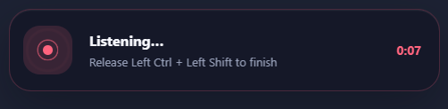
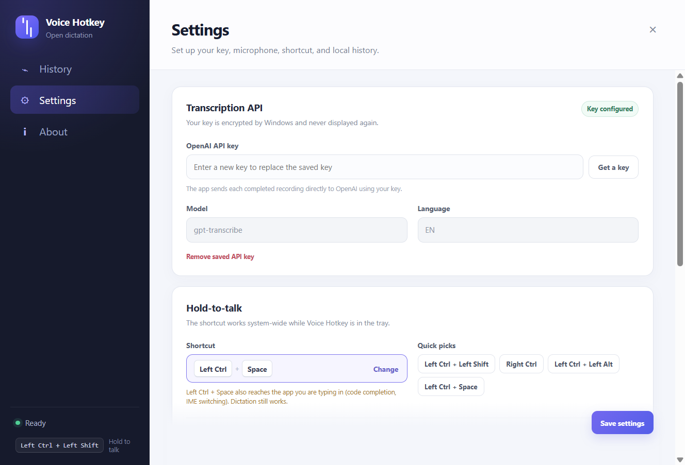
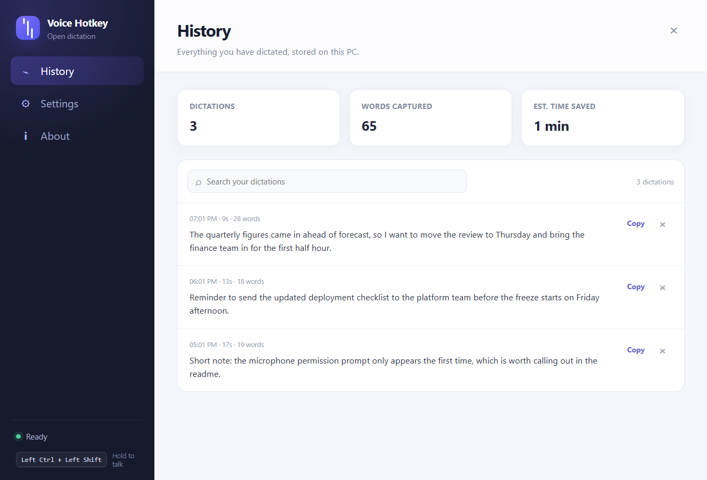

# Voice Hotkey

Open-source push-to-talk dictation for Windows. Hold a shortcut, speak, release — the transcript lands in your clipboard and is pasted into whatever you were typing in.

No subscription, no shared backend, no maintainer holding your transcription bill. You bring your own OpenAI API key — or point the app at any OpenAI-compatible transcription endpoint, including a local one — and audio goes straight from your machine to the provider you configured.



## How it works

1. Hold **Left Ctrl + Left Shift** (configurable — see below).
2. Speak. A small overlay near the bottom of your screen shows that it is listening, and for how long.
3. Release. The audio is transcribed, copied to your clipboard, pasted into the active app, and saved to your local history.

Before upload, leading and trailing silence is trimmed so you are not billed for it, and the audio is converted to 16 kHz WAV — the format these models transcribe best. Audio is held in memory only as long as it takes to transcribe, and is never written to disk. Transcript text and basic timing are stored locally in `%APPDATA%\voice-hotkey\history.json`.

A transcription failure keeps the recording in memory, so **Retry last dictation** (in the tray menu) can send the exact same take again — no need to re-speak.

## Install

Download the latest `.exe` installer or portable `.zip` from [Releases](../../releases).

The build is **not code-signed**, so Windows SmartScreen will warn on first run — see [SECURITY.md](SECURITY.md). Install it only if you trust the source you got it from, or build it yourself from this repo.

Add your OpenAI API key in **Settings** before your first dictation. Create one at [platform.openai.com/api-keys](https://platform.openai.com/api-keys). The key is encrypted with Windows DPAPI via Electron's `safeStorage` and is never displayed again.

## Choosing a shortcut

Click **Change** in Settings, hold the keys you want, and let go. The keys are captured through the same global hook that watches for the shortcut, so left and right modifiers are told apart exactly as the matcher sees them.



Two things make an arbitrary chord safe to hold:

**Exclusivity.** A chord never fires while a modifier outside it is held. This matters most on European layouts: Windows reports **AltGr as a phantom Left Ctrl plus Right Alt**, so without this rule `AltGr + Space` would start dictating every time you typed `@` on a Swiss or French keyboard.

**Hold delay.** A chord that is a prefix of a longer shortcut — `Left Ctrl + Left Shift` versus `Ctrl + Shift + T` — has to be held on its own for a moment before recording starts. Any other keypress cancels it. The default is 250 ms, adjustable from **Instantly** to **400 ms**.

Some chords are rejected outright (a bare `Left Ctrl` would fire on every Ctrl shortcut; a bare letter would fire while you type). Others are allowed with a warning, because the hook **observes** input and cannot swallow it: anything containing a character key also reaches the focused app. `Ctrl + Space` works fine for dictation, but it will still trigger code completion in your editor and may switch IME. You are told, and you decide.

Safe solo keys — `Right Ctrl`, `Right Alt`, `Right Shift`, `Scroll Lock`, `F13`–`F24` — can be used on their own.

## Settings

| Setting | Notes |
| --- | --- |
| Shortcut | Any 1–4 key chord. Quick picks for the common ones. |
| Start after holding for | Instantly / 150 / 250 / 400 ms. Keep a delay for modifier-only chords. |
| Hold-to-talk enabled | Turns the global hook off without quitting. Also in the tray menu. |
| Paste automatically | Sends Ctrl + V after copying. Turn off to copy only. |
| Light cleanup | Removes “um”, “uh”, “erm”, “hmm” and repairs spacing and capitalisation. Never rewrites your wording. |
| Play sounds | A short beep when recording starts, two when the transcript lands. |
| Start with Windows | Launches minimised to the tray. |
| Microphone | Windows default, or a specific device. A saved device that is unplugged stays selected. **Test** shows a live level meter so you can check a device before dictating. |
| Keep transcripts | Forever, 30 days, 90 days, or 1 year. |
| API endpoint | Optional. Leave empty for OpenAI, or enter any OpenAI-compatible base URL — `https://api.groq.com/openai/v1`, Azure OpenAI, or `http://localhost:8080/v1` for a locally hosted transcription server. |
| Model | `gpt-transcribe` (default), `gpt-4o-transcribe`, `gpt-4o-mini-transcribe`, `whisper-1` — or any custom model name when a custom endpoint is configured. |
| Language | Automatic or a specific ISO-639-1 language; the transcription prompt adapts to it. |

Auto-paste is honest about its limits: injected keystrokes cannot reach elevated (administrator) windows, and transcription takes seconds during which you may switch apps. When either happens, the app copies the transcript and tells you to paste manually instead of claiming a paste that never landed.

The tray menu also has **Reset shortcut state**, for the rare case where a key-up is missed — which happens if you release the chord while a UAC prompt has focus, since the hook cannot see input in elevated windows — and **Retry last dictation** after a failed transcription.



History is grouped by day, searchable (with match highlighting), exportable as `.txt` or `.json`, and rendered incrementally so thousands of entries stay smooth.

## Build from source

Requires Node 22.12+ and npm 10+.

```bash
git clone https://github.com/banuca/voice-hotkey.git
cd voice-hotkey
npm install
npm run dev            # run against the dev server (HMR included)
npm test               # unit tests
npm run typecheck      # tsc --noEmit
npm run lint
npm run build:win      # installer + portable zip into dist/
```

`uiohook-napi` ships prebuilt native binaries, so no compiler toolchain is needed.

### Layout

```text
src/main/       Electron main: windows, tray, IPC, the dictation phase machine,
                the global shortcut controller, the transcription client,
                foreground-window tracking, and crash-safe JSON storage.
src/preload/    contextBridge APIs for the UI and the recorder.
src/renderer/   The settings/history window, plus separate tiny entry points
                for the overlay and the recorder so they do not load the whole
                app. Audio prep (trim + 16 kHz WAV) lives here too.
src/shared/     Keycode table, chord matching and validation, text cleanup,
                types.
tests/          Vitest unit tests.
```

Every window runs with `contextIsolation: true`, `sandbox: true`, `nodeIntegration: false`, a restrictive CSP, and navigation and `window.open` denied. The network request to the transcription API is made from the main process; renderers have `connect-src 'none'` in production builds.

## Privacy

- Completed recordings are sent to `api.openai.com` using **your** key — or to the endpoint you configured — and nowhere else.
- Audio never touches disk. It is zeroed in memory after the request (and after a retry is replaced or dropped).
- History is a plain local JSON file you can read or delete. **Delete all transcript history** in Settings wipes it.
- The API key is encrypted at rest with Windows DPAPI and scoped to your user account.
- No telemetry, no analytics, no auto-update calls.

## License

[MIT](LICENSE). An independent project with no affiliation to any commercial dictation product.
