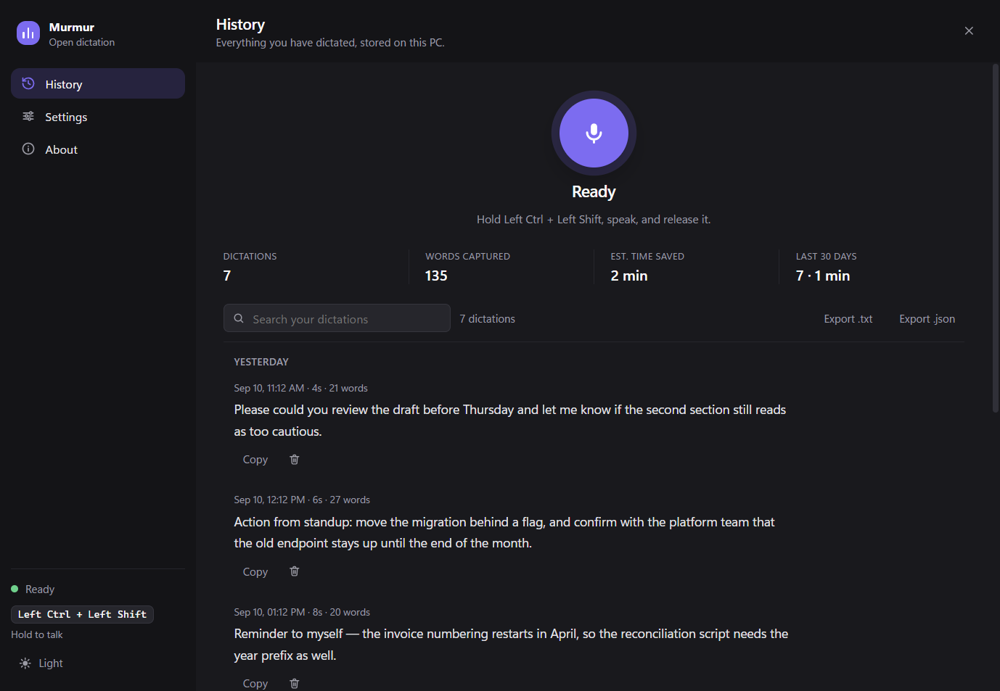
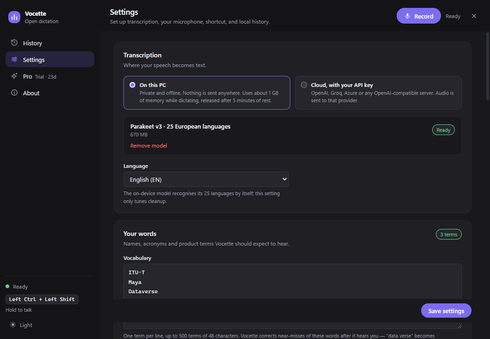
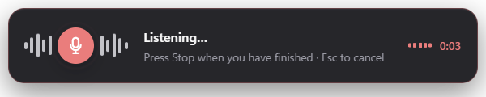
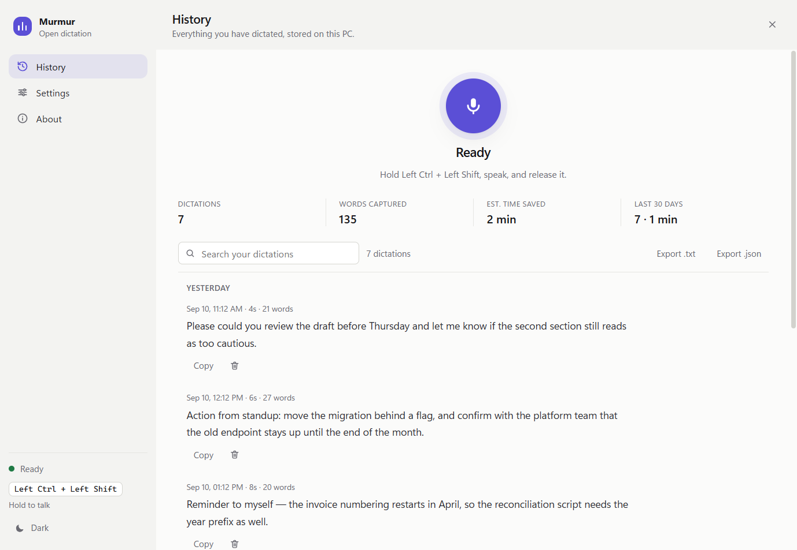

# Vocette

Dictation for Windows that runs on your PC. Hold a shortcut, speak, let go — your words are typed into the app you were in, tidied up, with your own names and terms spelled right.

- **On this PC, by default.** Speech is transcribed on your computer by NVIDIA's Parakeet v3 model (25 European languages). No account and no API key: once the 670 MB model is downloaded, nothing you say leaves your computer, and dictation needs no internet connection. On the laptop it is developed on, the text is ready about half a second after you let go.
- **Or a cloud provider of your choice.** OpenAI, Groq, Azure or any OpenAI-compatible server, with your own key — or a server of your own that needs none.
- **Free, and genuinely good.** Everyone gets Pro free for 30 days. After that, Free keeps everything dictation needs, for good. Pro — US$4.99 a month or US$49 a year — is for power users: long vocabulary and snippet lists, and AI polish.



## How it works

1. Hold **Left Ctrl + Left Shift** (configurable), or press **Record** in the window.
2. Speak. A small overlay near the bottom of your screen shows that it is listening, and for how long.
3. Release. The audio is transcribed, cleaned up, pasted into the active app where that is safe, and saved to your local history. The clipboard is only borrowed: what you had copied is put back.

Leading and trailing silence is trimmed and the audio converted to 16 kHz WAV, the format these models transcribe best — so a cloud provider does not bill you for silence, and a take with no speech in it is not transcribed at all. Audio is held in memory only as long as it takes to transcribe, and is never written to disk. Transcript text and basic timing are stored locally, beside your settings, in the app's own data folder.

A transcription failure keeps the recording in memory, so **Retry** — beside Record in the window, or **Retry last dictation** in the tray — can send the exact same take again, with no need to re-speak. A retried take is copied to the clipboard rather than pasted, because by then the window in front is Vocette, not the app you were dictating into. Before it comes to that, a busy cloud service — a rate limit, a server error or a dropped connection — is retried once on its own, so most of those failures never reach you.

## Two ways to record, and a button that always works

**Hold to talk** is the default: hold the shortcut while you speak, release to finish.

**Press to start and stop** is a toggle — one press begins, the next ends it, and Esc on its own cancels (Vocette only watches the key, so the app in front sees that Esc too). Choose it because you prefer it, or because you are on a desktop that cannot report a key release.

**Record / Stop / Cancel** live in the top bar of the window, on every page. They drive exactly the same dictation controller as the shortcut, so there is never a second microphone owner. A recording started from the window is delivered to your clipboard and nothing is typed anywhere — the window in front is Vocette itself, not the app you wanted the text in.

Your choice of mode is stored as a preference. If you move to a session that cannot honour it, the app falls back and says so, and your preference comes back the moment the capability does.

## What works where

**Windows is the platform Vocette is built and verified on.** The code also has macOS and Linux adapters, and the tables below say what each is designed to do, but those have never been run on real hardware, and no macOS or Linux build is published. The on-device engine has been run on Windows x64 only.

Designed behaviour, by platform — every one can open the app, record from the window, transcribe, copy and keep local history; a global shortcut and automatic paste are the parts that vary:

| | Windows | macOS | Linux / X11 | Linux / Wayland |
|---|---|---|---|---|
| Hold to talk | Yes | With Input Monitoring | Yes | No |
| Press to start/stop | Yes | With Input Monitoring | Yes | Yes, via the desktop portal |
| Paste target checked | Window | Frontmost app | Focused X window | No |
| Automatic paste | `Ctrl + V` | `Command + V`, with Accessibility | `Ctrl + V` | No — clipboard only |

Where something is not possible, the app says so in Settings and in its first-run guidance, in its own words, and carries on working with the Record button and the clipboard. It never pretends, and it never asks you to run it as administrator or root.

**Verification status is tracked separately from capability.** Only Windows has been exercised on real hardware; macOS and Linux are implemented and unit-tested but have not been run. See [docs/platform-support.md](docs/platform-support.md) for the matrix and the exact remaining checks.

## Install

Download the Windows installer (`.exe`) or the portable `.zip` from [Releases](../../releases). It installs for your user only and asks for no administrator rights; `SHA256SUMS.txt` beside it lets you check the download.

Builds are **not code-signed yet**, so Windows SmartScreen warns on first run — see [SECURITY.md](SECURITY.md). Install one only if you trust the source you got it from, or build it yourself from this repo. Uninstalling keeps your settings, history and the speech model; delete `%APPDATA%\Murmur` and `%LOCALAPPDATA%\Murmur` to remove them too.

On first run, History opens on **Get started**: press **Download** to fetch the speech model (670 MB, once), and dictation then runs on your PC with nothing sent anywhere. The download shows its progress, can be cancelled and resumed, and is checked before first use. Prefer a cloud provider? Choose **Cloud, with your API key** under **Settings → Transcription** and add your key there — for OpenAI, create one at [platform.openai.com/api-keys](https://platform.openai.com/api-keys).

## Free and Pro

Everyone gets Pro free for their first 30 days. After that, Free keeps everything you need, for good — no nagging, no countdown, and dictation itself is never limited.

| | Free, for good | Pro |
|---|---|---|
| Dictation on this PC or in the cloud, any length, as often as you like | ✓ | ✓ |
| Cleanup, spoken corrections, spoken line breaks | ✓ | ✓ |
| Clipboard restore, paste last dictation, Retry, history | ✓ | ✓ |
| Vocabulary terms in use | 50 | 500 |
| Replacements and snippets in use | 20 | 200 |
| AI polish — your dictation rewritten as Clean, Professional, Casual or Notes | — | ✓ |

Pro is a subscription — **US$4.99 a month or US$49 a year** (two months free) — through Polar, the payment provider, for up to ten devices. At launch, the first 100 subscribers to each plan pay 25% less on monthly and half price on yearly, for as long as they stay subscribed; the offer closes on 31 December 2026. Cancel any time in your Polar account: Pro stays on until the end of the period you paid for, then Vocette carries on as Free. Nothing is deleted when Pro lapses: a longer list keeps every line, only its first part is used, and the note under each box says so. **Activate** on the Pro page sends your key and a device label (“Vocette on Windows · 7F3A”) to Polar; after that, while you are subscribed, Vocette asks Polar once a day whether the subscription is still active. Offline, Pro keeps working for 30 days after the last answer. If you subscribe again after cancelling, the same key works again. **Release this PC** frees a device slot for another one.

## Your API key

The key is encrypted at rest by the operating system — DPAPI on Windows, the Keychain on macOS, libsecret or KWallet on Linux — and is never displayed again.

On a Linux desktop with no unlocked keyring, Electron's secure storage silently falls back to a hard-coded key. That is obfuscation, not encryption, so **Vocette refuses to write your key there**. Instead it offers a clearly labelled **session-only key**: held in memory in the main process, never written anywhere, gone when you quit. You can also unlock a keyring and save the key properly.



## Choosing a shortcut

Click **Change** in Settings, hold the keys you want, and let go. The keys are captured through the same global hook that watches for the shortcut, so left and right modifiers are told apart exactly as the matcher sees them.

Two things make an arbitrary chord safe to hold:

**Exclusivity.** A chord never fires while a modifier outside it is held. This matters most on European layouts: Windows reports **AltGr as a phantom Left Ctrl plus Right Alt**, so without this rule `AltGr + Space` would start dictating every time you typed `@` on a Swiss or French keyboard.

**Hold delay.** A chord that is a prefix of a longer shortcut — `Left Ctrl + Left Shift` versus `Ctrl + Shift + T` — has to be held on its own for a moment before recording starts. Any other keypress cancels it. The default is 250 ms, adjustable from **Instantly** to **400 ms**.

Some chords are rejected outright (a bare `Left Ctrl` would fire on every Ctrl shortcut; a bare letter would fire while you type). Others are allowed with a warning, because the hook **observes** input and cannot swallow it: anything containing a character key also reaches the focused app. `Ctrl + Space` works fine for dictation, but it will still trigger code completion in your editor and may switch IME. You are told, and you decide.

Safe solo keys — `Right Ctrl`, `Right Alt`, `Right Shift`, `Scroll Lock`, `F13`–`F24` — can be used on their own.

On Wayland the shortcut is registered with the desktop portal rather than observed, which is more restrictive: it needs one ordinary key as well as its modifiers, and it cannot tell left from right. The app explains both, and live capture is replaced by the quick picks.

## Settings

| Setting | Notes |
| --- | --- |
| Transcription | **On this PC** (default): the Parakeet v3 model, downloaded once (670 MB) into `%LOCALAPPDATA%\Murmur\models`, checked against pinned SHA-256 hashes before first use, and unloaded after 5 minutes of rest to give its memory back. **Cloud, with your API key**: the fields below. |
| Recording mode | Hold to talk, or press to start and stop. Stored as a preference even where the platform cannot honour it. |
| Shortcut | Any 1–4 key chord. Quick picks for the common ones. |
| Start after holding for | Instantly / 150 / 250 / 400 ms. Keep a delay for modifier-only chords. |
| Start listening as soon as the shortcut is held | On by default. The microphone opens once the keys have been held on their own for a moment (a tenth of a second) instead of after the whole hold delay, so a first word spoken straight away is less likely to be cut off. A shortcut typed at speed, like Ctrl + Shift + T, brings its third key within that moment and never opens the microphone. If it has opened and the keys turn out to be part of another shortcut, or are let go too soon, what was captured is thrown away unheard — nothing is transcribed or stored, and no overlay appears — though the system's microphone indicator may flash briefly. With the on-device engine the speech model starts loading once the recording is confirmed, while you speak. Needs a keyboard Vocette can watch, so it is disabled, with the reason, on Wayland; with the delay set to Instantly, recording starts as the keys go down anyway. |
| Global shortcut enabled | Turns the system-wide shortcut off without quitting. Also in the tray menu. |
| Paste automatically | Sends the platform's paste chord after copying. Disabled, with a reason, where the OS will not allow it. |
| Put my clipboard back | On by default. After an automatic paste, whatever you had copied is put back about ¾ s later — text, formatting and images; a file list copied in Explorer, or an application's own private format, cannot be restored. When Vocette does not paste — clipboard-only delivery, focus moved, an elevated window — the transcript stays on the clipboard for you to paste. Turn off to keep every transcript on the clipboard. |
| Paste last dictation with Alt + Shift + V | Windows only, for now; on by default. Pastes your newest transcript again into the window in front, with the same focus and elevation checks as a dictation — handy when a paste went to the wrong place. If another app already owns the combination, Settings says so. |
| Your words | A vocabulary of names, acronyms and product terms, one per line. With a cloud provider they are **sent to it with every dictation** — that is how they work, so it is not a place for a secret. Against OpenAI, `gpt-transcribe` takes them as a dedicated `keywords` list. Every other model, and every custom endpoint, is given them through the transcription prompt instead, which has room for about 480 characters of terms; the line under the box says which is in use and warns when the list no longer fits. On every engine, Vocette then corrects near-misses of your terms on this computer, before cleanup: “ITUT” becomes “ITU-T”, “data verse” becomes “Dataverse”, “Kirinda” becomes “Kirinde”. A common English word is never turned into a term (“coffee” stays “coffee” with “koffi” in the list), checked against the SCOWL word list; sound-alike matching is English only. |
| Replacements and snippets | One rule per line, `spoken => written`: `itu => ITU`, `my email => name@example.com`, `sign off => Best regards,\nAlex`. `\n` is a line break, `{date}` and `{time}` become today's date and the time, and a line starting with `#` is a comment. Applied on this computer after cleanup — never sent to your provider — matching whole words and ignoring capitals; what you wrote goes in exactly as typed, so code keeps its case. Free applies the first 20 rules and Pro up to 200, and the line under the box counts them and any lines it could not read. |
| Remove filler words | Drops “um”, “uh”, “hmm”, stutters like “I I”, and a filler “like” or “you know” set off by commas. Hesitation sounds are removed in every language; the English wording rules apply to English, and to Automatic when the text reads as English. Nothing you said is rewritten, and `example.com`, `3.5` and `10:30` are left alone. |
| Follow spoken corrections | “Scratch that” drops the sentence before it; “Tuesday, no sorry, Wednesday” becomes “Wednesday”. Only clear-cut corrections are acted on — anything ambiguous is left as you said it. English. |
| Spoken line breaks | Say “new line” or “new paragraph” as a phrase of its own. English. |
| Play sounds | A short beep when recording starts, two when the transcript lands. |
| Start with Windows / Open at login / Start when I sign in | Launches minimised to the tray. |
| Microphone | System default, or a specific device. A saved device that is unplugged stays selected. **Test** shows a live level meter so you can check a device before dictating. |
| Keep transcripts | Forever, 30 days, 90 days, or 1 year. |
| API endpoint | Optional. Leave empty for OpenAI, or enter any OpenAI-compatible base URL — `https://api.groq.com/openai/v1`, Azure OpenAI, or `http://localhost:8080/v1` for a locally hosted transcription server. With an endpoint set, the API key is optional too: a server of your own (whisper.cpp's server, Speaches, a corporate deployment) may need none, and without a key the request carries no `Authorization` header. OpenAI, with the field empty, always needs a key. **Test connection** sends one second of silence to the saved endpoint, once, and reports how long the server took to answer, or why it failed; it uses saved settings only, so save any changes first. |
| Model | `gpt-transcribe` (default), `gpt-4o-transcribe`, `gpt-4o-mini-transcribe`, `whisper-1` — or any custom model name when a custom endpoint is configured. |
| Language | Automatic or a specific ISO-639-1 language; the transcription prompt adapts to it. |
| AI polish (Pro) | Off by default. A language model rewrites each dictation before it is pasted: **Clean**, **Professional**, **Casual** or **Notes**, plus optional instructions. Provider: OpenAI, Ollama or LM Studio on this PC, Groq, or any OpenAI-compatible server. **Wait at most** 2, 4 or 8 s — past that, or when the reply looks wrong, your text is pasted unpolished and the overlay says so. **Test** sends one short sentence to the saved provider. |
| Theme | Modern Dark (default) or light, after Visual Studio Code's Light Modern. Switched from the foot of the sidebar, saved with everything else, and followed by the overlay. |

**About** has the update check: **Check for updates once a day** (off unless you switch it on) and **Check now**. **Pro** shows your plan, the trial, **Buy Pro** and the licence key field.

Auto-paste is honest about its limits. Injected keystrokes cannot reach an elevated Windows window or a macOS secure-input field, and transcription takes seconds during which you may switch apps. When either happens — or when the target simply cannot be identified — the app leaves the transcript on your clipboard and tells you to paste manually instead of claiming a paste that never landed. Focus is never forcibly taken back to make a paste succeed. When a paste does go through, the clipboard is only borrowed: what you had copied is put back moments later, so the overlay says **Pasted** rather than implying the transcript is still there. If it went to the wrong window, **Alt + Shift + V** pastes your last dictation again (Windows).

The tray menu also has **Start / Stop recording**, **Cancel dictation**, **Reset shortcut state** — for the rare case where a key-up is missed, which happens if you release the chord while a UAC prompt has focus (after sleep or the lock screen Vocette does this itself) — and **Retry last dictation** after a failed transcription, which the window also offers as **Retry** beside Record.





Every dictation is timed from letting go until its text is ready to paste: the overlay shows the wait (“0.4s”), each History entry ends “ready in 0.4s”, and **Typical wait** at the top of History is the middle of your last 50. History is grouped by day, searchable (with match highlighting), exportable as `.txt` or `.json`, and rendered incrementally so thousands of entries stay smooth. **Edit** corrects an entry in place (Ctrl + Enter saves — Command + Enter on a Mac — and Esc cancels) and marks it “Edited”; **Delete** acts at once, with **Undo** at the foot of the page for 8 seconds. Whenever cleanup, your words or a replacement changed what the recogniser heard, **Show original** switches the entry to its raw text and **Copy original** copies it. An edit keeps the text it replaced the same way, so to remove words for good, delete the dictation. If a save fails, a persistent banner says so without interrupting the dictation you just finished.

## Build from source

Requires Node 22.12+ and npm 10+.

```bash
git clone https://github.com/banuca/murmur.git
cd murmur
npm install
npm run dev            # run against the dev server (HMR included)
npm test               # unit tests
npm run typecheck      # tsc --noEmit
npm run lint
```

A Windows release is one command, built outside the repository and checked before it is trusted — see [docs/release.md](docs/release.md):

```bash
npm run release:win    # gates, installer + zip in %LOCALAPPDATA%\vocette-release\<version>,
                       # native check, SHA256SUMS.txt
```

The native prebuilds are chosen at install time, so each platform has to be built on its own operating system and architecture. `build:mac` and `build:linux` exist but have never been run.

`uiohook-napi` and `koffi` both ship prebuilt N-API binaries, so no compiler toolchain is needed.

### Layout

```text
src/main/           Electron main: windows, tray, IPC, the dictation phase
                    machine, the transcription and polish clients, the licence
                    client, the update check, and crash-safe JSON storage.
src/main/engine/    The on-device engine: the model store and its download, and
                    the utility process that runs sherpa-onnx.
src/main/platform/  The desktop boundary: global shortcuts, paste targets, key
                    injection, permissions and launch-at-login, one adapter per
                    operating system, every native dependency loaded lazily.
src/preload/        contextBridge APIs for the UI and the recorder.
src/renderer/       The settings/history window, plus separate tiny entry points
                    for the overlay and the recorder so they do not load the
                    whole app. Audio prep (trim + 16 kHz WAV) lives here too.
src/shared/         Keycode table, chord matching and validation, accelerator
                    conversion, capability types, text cleanup, types.
tests/              Vitest unit tests.
docs/               Platform support matrix, verification records, screenshots.
```

Every window runs with `contextIsolation: true`, `sandbox: true`, `nodeIntegration: false`, a restrictive CSP, and navigation and `window.open` denied. The network request to the transcription API is made from the main process; renderers have `connect-src 'none'` in production builds.

## Privacy

Every network request Vocette can make, and when:

1. **The speech model**, once, from `huggingface.co` (a pinned commit, SHA-256 checked), when you press **Download**.
2. **Cloud transcription**, only if you chose **Cloud**: each recording and your vocabulary go to the endpoint you configured, with your key.
3. **AI polish**, only if you switched it on (Pro): the text of each dictation — never the audio — with your instructions and vocabulary, to the provider you chose.
4. **Pro**, only with a licence key activated: your key and a device label to Polar when you press **Activate**, then a check of your subscription at most once a day.
5. **The update check**, only if you switched it on or press **Check now**: one request to GitHub for the latest version number.

Nothing else: no telemetry, no analytics, no crash reporting. With the on-device engine and nothing else switched on, nothing you say ever leaves your computer.

- With the on-device engine, audio is transcribed in a separate process on your PC and never sent anywhere. With a cloud provider, completed recordings go to `api.openai.com` using **your** key — or to the endpoint you configured — and nowhere else.
- Audio never touches disk. It is zeroed in memory after the request (and after a retry is replaced, cancelled or dropped).
- History is a plain local JSON file you can read or delete. Deleting an entry, clearing history, retention pruning, or removing the saved API key writes the new store state, removes Vocette's stale `.tmp` and `.corrupt` recovery copies, and refreshes its `.bak` copy from the scrubbed primary before reporting success. This is not forensic erasure and does not delete exports, clipboard data, filesystem snapshots, or provider-held data.
- A `history.json` Vocette cannot read is kept as `history.json.corrupt` instead of being overwritten, and startup tells you where it is. Retention cannot prune that copy entry by entry, because its contents could not be parsed, so it is kept for now as a whole. A later cleanup deletes the whole file — with retention enabled, that includes the next startup once the primary file is readable again. Copy it somewhere else first if you need it to recover anything.
- If retention cannot be applied at startup, Vocette still launches and says so, rather than refusing to start. It cannot confirm the cleanup finished, and part of it may already have been applied, so expired data may remain until a later attempt succeeds.
- The API key is encrypted at rest by the operating system and scoped to your user account — or, where that is not possible, kept for the session only and never written at all.
- The foreground checks read a window handle and an elevation or secure-input flag. No window contents, titles or input are read, and nothing is stored.
- Before an automatic paste, what is on your clipboard is copied into memory so it can be put back afterwards. It is held only until then, and is never written to disk or sent anywhere.
- Activating Pro sends your licence key, a device label and the app version to Polar (US) when you press **Activate**. While a key is activated, Vocette asks Polar at most once a day whether its subscription is still active, sending the key and this PC's activation; **Check now** on the Pro page does the same at once, and **Release this PC** sends the key to free the slot. Nothing else about Pro is ever sent, and the buyer details Polar returns are discarded.
- AI polish (Pro) is off until you switch it on in **Settings → AI polish**. Then the text of each dictation — never the audio — is sent to the provider you chose there, with your extra instructions and your vocabulary terms, and nothing else. Choose **Ollama on this PC** or **LM Studio on this PC** to keep it on your computer. Its key is encrypted like the transcription key; the OpenAI preset borrows your OpenAI transcription key only when transcription goes to OpenAI too.
- Checking for updates is off until you switch it on in **About**. Then — and whenever you press **Check now** — Vocette sends one request to GitHub (`api.github.com`) for the latest version number, at most once a day on its own. Nothing about you or your dictation is sent, and nothing is ever downloaded or installed automatically.
- No telemetry, no analytics, no automatic updates.

## License

[MIT](LICENSE). An independent project with no affiliation to any commercial dictation product.
